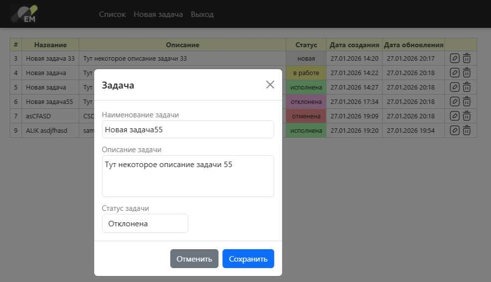

 

Damp базы данных /database/schema.sql

            'database' => 'todo_db'
            'username' => 'test'
            'password' => 'J7gU78Nk9dUi2'

Клиентская часть запускается /client/index.php

Логин: <b>test</b>  Пароль: <b>123456</b>

